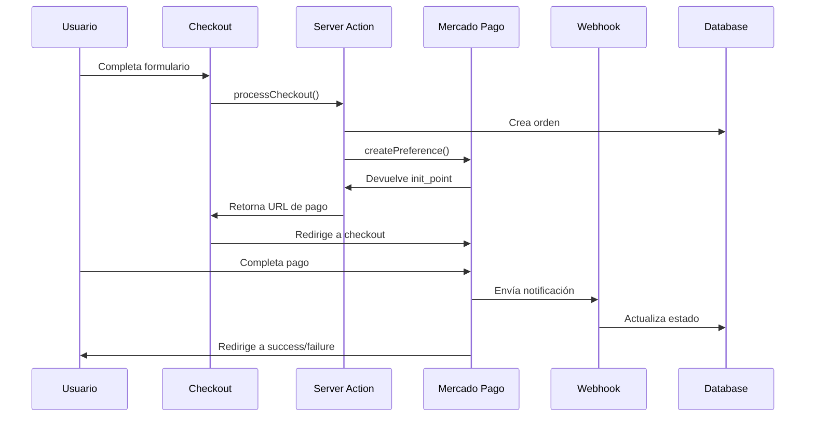

# Guía Completa de Integración - Mercado Pago CheckoutPro

Esta guía detalla la implementación completa de Mercado Pago CheckoutPro en el e-commerce, incluyendo múltiples métodos de pago.

## Tabla de Contenidos

1. [Introducción](#introducción)
2. [Configuración Inicial](#configuración-inicial)
3. [Arquitectura de la Integración](#arquitectura-de-la-integración)
4. [Flujo de Pago](#flujo-de-pago)
5. [Métodos de Pago Soportados](#métodos-de-pago-soportados)
6. [Webhooks y Notificaciones](#webhooks-y-notificaciones)
7. [Testing](#testing)
8. [Troubleshooting](#troubleshooting)
9. [Consideraciones de Producción](#consideraciones-de-producción)

---

## Introducción

Esta integración soporta tres métodos de pago:

- **Mercado Pago CheckoutPro**: Redirección a checkout de Mercado Pago
- **Transferencia Bancaria**: Con carga de comprobante
- **Efectivo contra Entrega**: Pago al recibir el pedido

### Características Principales

- ✅ SDK oficial de Mercado Pago v2.x
- ✅ Soporte para múltiples métodos de pago
- ✅ Webhooks para actualizaciones en tiempo real
- ✅ Páginas de callback (success, failure, pending)
- ✅ Gestión de estados de orden
- ✅ Logging completo para debugging
- ✅ Soporte para sandbox y producción

---

## Configuración Inicial

### 1. Obtener Credenciales de Mercado Pago

1. Ingresa a [Mercado Pago Developers](https://www.mercadopago.com.ar/developers/panel/app)
2. Crea una nueva aplicación o selecciona una existente
3. Ve a "Credenciales"
4. Copia:
   - **Access Token de Prueba** (TEST-xxxx) para desarrollo
   - **Access Token de Producción** (APP_USR-xxxx) para producción

### 2. Configurar Variables de Entorno

Copia el archivo `.env.example` a `.env.local`:

```bash
cp .env.example .env.local
```

Edita `.env.local` y configura las siguientes variables:

```bash
# OBLIGATORIAS
MP_ACCESS_TOKEN="TEST-1234567890-123456-abc123def456-abc123def456"
NEXT_PUBLIC_APP_URL="http://localhost:3000"

# OPCIONALES
MP_WEBHOOK_SECRET="tu-secreto-webhook"
MP_SANDBOX="true"
MP_DEBUG="true"
MP_EMAIL_NOTIFICATIONS="false"
```

### 3. Instalar Dependencias

El SDK ya está instalado en el proyecto:

```json
{
  "dependencies": {
    "mercadopago": "^2.11.0"
  }
}
```

Si necesitas reinstalar:

```bash
npm install mercadopago
```

---

## Arquitectura de la Integración

### Estructura de Archivos

```
.
├── lib/
│   └── mercadopago/
│       ├── config.ts           # Configuración y helpers
│       ├── preferences.ts      # Creación de preferencias (NUEVO)
│       ├── payments.ts         # Gestión de pagos (NUEVO)
│       ├── client.ts           # Cliente MP
│       ├── checkout.ts         # Checkout existente
│       ├── webhooks.ts         # Procesamiento de webhooks
│       ├── types.ts            # Tipos TypeScript
│       └── index.ts            # Exportaciones
├── actions/
│   ├── checkout/
│   │   └── process.ts          # Server action del checkout
│   └── orders/
│       └── mutations.ts        # CRUD de órdenes
├── app/
│   ├── api/
│   │   └── webhooks/
│   │       └── mercadopago/
│   │           └── route.ts    # Endpoint de webhooks
│   └── (store)/
│       └── checkout/
│           ├── page.tsx        # Página de checkout
│           ├── success/
│           │   └── page.tsx    # Pago exitoso
│           ├── failure/
│           │   └── page.tsx    # Pago fallido
│           └── pending/
│               └── page.tsx    # Pago pendiente
├── components/
│   └── checkout/
│       └── PaymentMethodSelector.tsx
└── schemas/
    ├── checkout.schema.ts
    └── order.schema.ts
```

### Componentes Principales

#### 1. **lib/mercadopago/config.ts**
- Configuración del cliente de Mercado Pago
- URLs de callback y webhooks
- Mapeo de estados
- Helpers y utilidades

#### 2. **lib/mercadopago/preferences.ts**
- Creación de preferencias de pago
- Configuración de items, pagador, URLs
- Manejo de errores

#### 3. **lib/mercadopago/payments.ts**
- Consulta de pagos
- Procesamiento de webhooks
- Reembolsos y cancelaciones

#### 4. **actions/checkout/process.ts**
- Server action principal
- Validación de stock
- Creación de órdenes
- Integración con MP según método de pago

#### 5. **app/api/webhooks/mercadopago/route.ts**
- Recepción de notificaciones
- Actualización de estados
- Logging de eventos

---

## Flujo de Pago

### 1. Flujo de Mercado Pago CheckoutPro



### 2. Flujo Paso a Paso

#### Paso 1: Usuario inicia checkout
```typescript
// app/(store)/checkout/page.tsx
const onSubmit = async (data: CheckoutFormInput) => {
  const result = await processCheckout({
    customer: data,
    items: cartItems,
    coupon: appliedCoupon,
  })

  if (result.success && result.data.initPoint) {
    window.location.href = result.data.initPoint
  }
}
```

#### Paso 2: Server crea la orden
```typescript
// actions/checkout/process.ts
const { data: order } = await supabase
  .from('orders')
  .insert({
    order_number: orderNumber,
    status: 'pending',
    customer_email: customer.email,
    // ... otros campos
  })
```

#### Paso 3: Se crea preferencia en MP
```typescript
// lib/mercadopago/preferences.ts
const preference = await createPreference({
  orderId: order.id,
  orderNumber: order.order_number,
  items: cartItems,
  customer,
  shippingCost,
})
```

#### Paso 4: Usuario completa pago en MP
El usuario es redirigido a Mercado Pago donde completa el pago.

#### Paso 5: MP envía webhook
```typescript
// app/api/webhooks/mercadopago/route.ts
const result = await processPaymentWebhook(paymentId)
```

#### Paso 6: Se actualiza la orden
```typescript
// lib/mercadopago/webhooks.ts
await supabase
  .from('orders')
  .update({
    mp_payment_id: paymentId,
    mp_status: payment.status,
    status: mapMercadoPagoStatus(payment.status),
    paid_at: payment.date_approved,
  })
  .eq('id', orderId)
```

---

## Métodos de Pago Soportados

### 1. Mercado Pago CheckoutPro

**Características:**
- Checkout completo de Mercado Pago
- Soporta tarjetas, efectivo, billeteras digitales
- Hasta 12 cuotas sin interés
- Protección del comprador

**Configuración:**
```typescript
// Schema de orden
payment_method: 'mercadopago'
mp_preference_id: string
mp_payment_id: string
mp_status: string
```

**Estados posibles:**
- `pending`: Pago pendiente
- `approved`: Pago aprobado
- `in_process`: En proceso
- `rejected`: Rechazado
- `cancelled`: Cancelado
- `refunded`: Reembolsado

### 2. Transferencia Bancaria

**Características:**
- El cliente transfiere a tu cuenta
- Debe subir comprobante de pago
- Requiere verificación manual

**Configuración:**
```typescript
payment_method: 'bank_transfer'
payment_proof_url: string
status: 'pending_payment'
```

**Datos bancarios** (configurar en `PaymentMethodSelector.tsx`):
```typescript
{
  banco: "Banco Nación",
  titular: "Tu Empresa SRL",
  cuit: "XX-XXXXXXXX-X",
  cbu: "XXXX XXXX XXXX XXXX XXXX XX",
  alias: "TU.EMPRESA.MERCADO"
}
```

### 3. Efectivo contra Entrega

**Características:**
- El cliente paga al recibir el pedido
- Solo efectivo
- Estado inicial: pending

**Configuración:**
```typescript
payment_method: 'cash_on_delivery'
status: 'pending'
```

---

## Webhooks y Notificaciones

### Configuración de Webhooks

#### 1. En Desarrollo (Local)

Para recibir webhooks en desarrollo local, usa **ngrok**:

```bash
# Instalar ngrok
npm install -g ngrok

# Iniciar túnel
ngrok http 3000

# Copiar URL HTTPS que aparece (ej: https://abc123.ngrok.io)
```

Actualiza tu `.env.local`:
```bash
NEXT_PUBLIC_APP_URL="https://abc123.ngrok.io"
```

#### 2. En Producción

La URL del webhook será:
```
https://tu-dominio.com/api/webhooks/mercadopago
```

#### 3. Configurar en Mercado Pago

1. Ve a tu aplicación en [Developers Panel](https://www.mercadopago.com.ar/developers/panel/app)
2. Sección "Webhooks"
3. Agrega nueva URL:
   ```
   https://tu-dominio.com/api/webhooks/mercadopago
   ```
4. Selecciona eventos:
   - ✅ Pagos
   - ✅ Merchant Orders (opcional)

### Manejo de Webhooks

El endpoint procesa notificaciones de Mercado Pago:

```typescript
// app/api/webhooks/mercadopago/route.ts
export async function POST(request: NextRequest) {
  const body = await request.json()

  if (body.type !== 'payment') {
    return NextResponse.json({ received: true })
  }

  const result = await processPaymentWebhook(body.data.id)

  return NextResponse.json({
    received: true,
    orderId: result.orderId,
    status: result.status,
  })
}
```

### Reintentos de Webhooks

Mercado Pago reintenta enviar webhooks si no recibe código 200:
- Primer reintento: inmediatamente
- Segundo: 5 minutos después
- Tercero: 1 hora después
- Cuarto: 12 horas después
- Quinto: 24 horas después

---

## Testing

### 1. Datos de Prueba de Mercado Pago

#### Tarjetas de Crédito

**Aprobada:**
- Número: 5031 7557 3453 0604
- CVV: 123
- Vencimiento: 11/25

**Rechazada (fondos insuficientes):**
- Número: 5031 4332 1540 6351
- CVV: 123
- Vencimiento: 11/25

**Más tarjetas:** [Ver documentación oficial](https://www.mercadopago.com.ar/developers/es/docs/checkout-pro/additional-content/test-cards)

### 2. Flujo de Testing

#### Test 1: Pago Exitoso
1. Inicia checkout con método "Mercado Pago"
2. Usa tarjeta aprobada
3. Verifica redirección a `/checkout/success`
4. Verifica que el webhook actualizó la orden
5. Verifica estado final: `paid`

#### Test 2: Pago Rechazado
1. Inicia checkout
2. Usa tarjeta rechazada
3. Verifica redirección a `/checkout/failure`
4. Verifica estado final: `cancelled`

#### Test 3: Transferencia Bancaria
1. Selecciona "Transferencia Bancaria"
2. Sube comprobante
3. Confirma pedido
4. Verifica estado: `pending_payment`
5. Como admin, marca como `paid` manualmente

#### Test 4: Efectivo contra Entrega
1. Selecciona "Efectivo contra Entrega"
2. Confirma pedido
3. Verifica estado: `pending`

### 3. Verificar Webhooks

#### En desarrollo con ngrok:
```bash
# Ver requests en ngrok
http://127.0.0.1:4040

# Logs en consola
MP_DEBUG=true npm run dev
```

#### Verificar en base de datos:
```sql
SELECT
  id,
  order_number,
  status,
  payment_method,
  mp_payment_id,
  mp_status,
  paid_at
FROM orders
WHERE id = 'orden-id';
```

---

## Troubleshooting

### Problema 1: "MP_ACCESS_TOKEN no está configurado"

**Causa:** Variable de entorno no definida

**Solución:**
```bash
# Verifica que existe .env.local
cat .env.local | grep MP_ACCESS_TOKEN

# Reinicia el servidor
npm run dev
```

### Problema 2: Webhook no llega

**Causas posibles:**
1. ngrok no está corriendo (desarrollo)
2. URL mal configurada en MP
3. Firewall bloqueando requests

**Solución:**
```bash
# Verifica ngrok
curl https://abc123.ngrok.io/api/webhooks/mercadopago

# Debería retornar: {"status":"ok"}
```

### Problema 3: Error al crear preferencia

**Error común:**
```
Error creating MP preference: payment_methods.excluded_payment_types
```

**Solución:**
Revisa que el objeto de preferencia tenga formato correcto:
```typescript
payment_methods: {
  excluded_payment_methods: [],
  excluded_payment_types: [],
  installments: 12,
}
```

### Problema 4: Orden no se actualiza después de pagar

**Causas posibles:**
1. Webhook no configurado
2. Error en processPaymentWebhook
3. external_reference incorrecto

**Solución:**
```typescript
// Verifica logs del webhook
console.log('Webhook received:', body)
console.log('Payment data:', payment)
console.log('External reference:', payment.external_reference)
```

### Problema 5: Stock no se descuenta

**Causa:** El webhook actualiza el stock solo cuando el pago es aprobado

**Verificar:**
```typescript
// lib/mercadopago/webhooks.ts
if (paymentData.status === 'approved') {
  await updateStock(orderId)
}
```

---

## Consideraciones de Producción

### 1. Seguridad

#### Validar webhooks
```typescript
// Implementar validación de firma
export function verifyWebhookSignature(
  payload: string,
  signature: string,
  secret: string
): boolean {
  const crypto = require('crypto')
  const hash = crypto
    .createHmac('sha256', secret)
    .update(payload)
    .digest('hex')
  return hash === signature
}
```

#### Rate limiting
```typescript
// Implementar rate limiting en webhooks
import { Ratelimit } from '@upstash/ratelimit'

const ratelimit = new Ratelimit({
  redis: redis,
  limiter: Ratelimit.slidingWindow(10, '10 s'),
})
```

### 2. Monitoreo

#### Logs estructurados
```typescript
// Usar Winston o similar
import winston from 'winston'

const logger = winston.createLogger({
  level: 'info',
  format: winston.format.json(),
  transports: [
    new winston.transports.File({ filename: 'mp-error.log', level: 'error' }),
    new winston.transports.File({ filename: 'mp-combined.log' }),
  ],
})
```

#### Métricas importantes
- Tasa de conversión de checkout
- Tiempo promedio de procesamiento
- Tasa de webhooks fallidos
- Distribución de métodos de pago

### 3. Performance

#### Caching de preferencias
```typescript
// Cache por 10 minutos
const preferenceCache = new Map()

export async function getCachedPreference(orderId: string) {
  if (preferenceCache.has(orderId)) {
    return preferenceCache.get(orderId)
  }

  const preference = await createPreference(...)
  preferenceCache.set(orderId, preference)

  setTimeout(() => preferenceCache.delete(orderId), 10 * 60 * 1000)

  return preference
}
```

### 4. Manejo de Errores

#### Retry con exponential backoff
```typescript
async function retryWithBackoff<T>(
  fn: () => Promise<T>,
  maxRetries = 3
): Promise<T> {
  for (let i = 0; i < maxRetries; i++) {
    try {
      return await fn()
    } catch (error) {
      if (i === maxRetries - 1) throw error
      await new Promise(resolve =>
        setTimeout(resolve, Math.pow(2, i) * 1000)
      )
    }
  }
  throw new Error('Max retries exceeded')
}
```

### 5. Cumplimiento PCI

Mercado Pago maneja los datos sensibles de tarjetas, por lo que no necesitas certificación PCI DSS. Sin embargo:

- ✅ Nunca almacenes datos de tarjetas
- ✅ Usa HTTPS en producción
- ✅ Mantén actualizado el SDK
- ✅ Audita logs regularmente

### 6. Checklist Pre-Producción

```markdown
- [ ] Variables de entorno configuradas
- [ ] Access Token de producción configurado
- [ ] HTTPS habilitado
- [ ] Webhooks configurados y testeados
- [ ] Datos bancarios actualizados
- [ ] Emails de notificación configurados
- [ ] Monitoreo de errores activo
- [ ] Backups de base de datos configurados
- [ ] Rate limiting implementado
- [ ] Logs centralizados
- [ ] Tests end-to-end pasando
- [ ] Documentación actualizada
```

---

## Recursos Adicionales

### Documentación Oficial
- [Mercado Pago Developers](https://www.mercadopago.com.ar/developers)
- [Checkout Pro](https://www.mercadopago.com.ar/developers/es/docs/checkout-pro)
- [Webhooks](https://www.mercadopago.com.ar/developers/es/docs/your-integrations/notifications/webhooks)
- [Tarjetas de Prueba](https://www.mercadopago.com.ar/developers/es/docs/checkout-pro/additional-content/test-cards)

### Soporte
- [Foro de desarrolladores](https://www.mercadopago.com.ar/developers/es/support)
- [Status de API](https://status.mercadopago.com/)

### Herramientas
- [ngrok](https://ngrok.com/) - Túneles HTTPS para desarrollo
- [Postman](https://www.postman.com/) - Testing de APIs
- [Insomnia](https://insomnia.rest/) - Cliente REST alternativo

---

## Changelog

### v1.0.0 (2025-12-07)
- ✨ Implementación inicial de Mercado Pago CheckoutPro
- ✨ Soporte para múltiples métodos de pago
- ✨ Webhooks y callbacks
- ✨ Páginas de éxito/error/pendiente
- 📝 Documentación completa

---

## Licencia

Este código es parte del proyecto e-commerce base y sigue la misma licencia del proyecto principal.

---

## Soporte

Para dudas o problemas con la integración:
1. Revisa esta documentación
2. Consulta los logs de la aplicación
3. Verifica la documentación oficial de Mercado Pago
4. Contacta al equipo de desarrollo

---

**Última actualización:** Diciembre 2025
