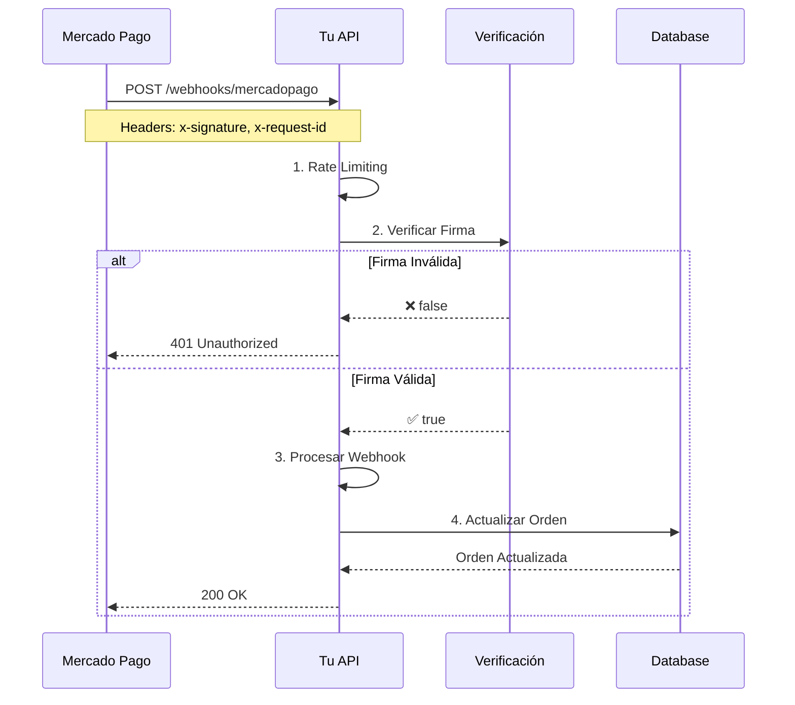

# Verificación de Firma de Webhooks - Mercado Pago

**Fecha:** 15 de Diciembre, 2025
**Estado:** ✅ Implementado
**Prioridad:** P0 - CRÍTICO

---

## 🎯 Objetivo

Prevenir que atacantes envíen webhooks falsos para manipular el estado de las órdenes y obtener productos sin pagar.

---

## ⚠️ El Problema

**Sin verificación de firma:**
- Cualquiera puede enviar un POST a `/api/webhooks/mercadopago`
- Puede incluir `data.id` de cualquier pago
- El sistema procesa el webhook como si fuera legítimo
- Resultado: Órdenes marcadas como pagadas sin pago real

**Ejemplo de ataque:**
```bash
# Atacante envía webhook falso
curl -X POST https://tu-app.com/api/webhooks/mercadopago \
  -H "Content-Type: application/json" \
  -d '{
    "type": "payment",
    "data": {"id": "123456789"}  # ID inventado o robado
  }'

# Sin verificación → Sistema marca orden como pagada ❌
```

---

## ✅ La Solución

Mercado Pago firma todos los webhooks con HMAC SHA256. Verificamos la firma antes de procesar cualquier webhook.

### Flujo de Verificación

```
1. Webhook llega a nuestro endpoint
   ↓
2. Extraemos headers: x-signature, x-request-id
   ↓
3. Parseamos x-signature → timestamp (ts) + hash (v1)
   ↓
4. Validamos timestamp (max 5 minutos)
   ↓
5. Construimos manifest: "id:{data.id};request-id:{x-request-id};ts:{ts};"
   ↓
6. Calculamos HMAC-SHA256 con nuestro secret
   ↓
7. Comparamos hash calculado con hash recibido
   ↓
8. Si coinciden → ✅ Procesamos webhook
   Si no coinciden → ❌ Rechazamos con 401
```

---

## 📦 Archivos Implementados

### 1. Función de Verificación

**`lib/mercadopago/verify-webhook.ts`** (NUEVO)

```typescript
export function verifyMercadoPagoWebhook(
  request: Request,
  dataId: string
): boolean
```

**Características:**
- ✅ Verifica headers requeridos (`x-signature`, `x-request-id`)
- ✅ Parsea formato de firma de MP: `ts=1234567890,v1=hash`
- ✅ Valida timestamp (máximo 5 minutos de antigüedad)
- ✅ Construye manifest según especificación de MP
- ✅ Calcula HMAC SHA256 con secret
- ✅ Compara hashes (case-insensitive)
- ✅ Logging detallado de éxito/fallo

### 2. Endpoint Protegido

**`app/api/webhooks/mercadopago/route.ts`** (MEJORADO)

```typescript
export async function POST(request: NextRequest) {
  // 1. Rate limiting (100 req/10s)

  // 2. Parsear body

  // 3. VERIFICAR FIRMA ⭐ NUEVO
  const isValidSignature = verifyMercadoPagoWebhook(request, dataId)

  if (!isValidSignature) {
    return NextResponse.json(
      { error: 'Unauthorized' },
      { status: 401 }
    )
  }

  // 4. Validar tipo de notificación

  // 5. Procesar pago

  // 6. Retornar 200
}
```

---

## 🔑 Variables de Entorno

### Requeridas

```env
# Secret proporcionado por Mercado Pago
MP_WEBHOOK_SECRET=3f236c3d14c7ad1ef2665e99f7ac3c731de3f148c403bd8ab2ce9e1bbed8c8e7
```

### Cómo Obtener el Secret

1. Ve a: https://www.mercadopago.com.uy/developers
2. Tu aplicación → **Webhooks**
3. Copia el **Secret** que aparece en la configuración
4. Agrégalo a `.env`:
   ```
   MP_WEBHOOK_SECRET=tu_secret_aqui
   ```

---

## 🧪 Testing

### ✅ Test 1: Webhook Válido de MP

**Escenario:** Mercado Pago envía webhook legítimo con firma correcta

**Resultado Esperado:**
- ✅ Firma verificada exitosamente
- ✅ Webhook procesado
- ✅ Orden actualizada
- ✅ Log: "✅ Webhook signature verified successfully"

### ❌ Test 2: Webhook Sin Firma

**Comando:**
```bash
curl -X POST http://localhost:3000/api/webhooks/mercadopago \
  -H "Content-Type: application/json" \
  -d '{
    "type": "payment",
    "data": {"id": "123456789"}
  }'
```

**Resultado Esperado:**
```json
{
  "error": "Unauthorized"
}
```
- Status: 401
- Log: "Missing required webhook headers"

### ❌ Test 3: Webhook con Firma Inválida

**Comando:**
```bash
curl -X POST http://localhost:3000/api/webhooks/mercadopago \
  -H "Content-Type: application/json" \
  -H "x-signature: ts=1234567890,v1=fakehash123" \
  -H "x-request-id: abc-123" \
  -d '{
    "type": "payment",
    "data": {"id": "123456789"}
  }'
```

**Resultado Esperado:**
```json
{
  "error": "Unauthorized"
}
```
- Status: 401
- Log: "⚠️ WEBHOOK SIGNATURE VERIFICATION FAILED ⚠️"

### ❌ Test 4: Webhook con Timestamp Viejo

**Escenario:** Webhook con timestamp mayor a 5 minutos

**Resultado Esperado:**
- Status: 401
- Log: "Webhook timestamp too old"

---

## 🛡️ Seguridad Implementada

### Protecciones Activas

| Protección | Implementación | Estado |
|------------|----------------|--------|
| **Verificación de Firma** | HMAC SHA256 | ✅ Activo |
| **Validación de Timestamp** | Max 5 min antigüedad | ✅ Activo |
| **Rate Limiting** | 100 req/10s | ✅ Activo |
| **Validación de Headers** | x-signature + x-request-id | ✅ Activo |
| **Logging de Intentos** | Fallos loggeados | ✅ Activo |

### Ataques Prevenidos

✅ **Webhook Spoofing**: Imposible enviar webhooks falsos sin el secret
✅ **Replay Attacks**: Timestamp evita reusar webhooks antiguos
✅ **Man-in-the-Middle**: HMAC garantiza integridad del payload
✅ **Brute Force**: Rate limiting previene ataques masivos

---

## 📊 Flujo Completo del Webhook



---

## 🔍 Logs de Ejemplo

### Webhook Exitoso
```
Webhook received: {
  "type": "payment",
  "data": { "id": "123456789" }
}
✅ Webhook signature verified successfully
Processing payment webhook: 123456789
✅ Payment 123456789 processed for order abc-123, status: approved
```

### Webhook Rechazado
```
Webhook received: {
  "type": "payment",
  "data": { "id": "123456789" }
}
⚠️ WEBHOOK SIGNATURE VERIFICATION FAILED ⚠️ {
  dataId: '123456789',
  type: 'payment',
  xSignature: 'ts=1234567890,v1=invalidhash',
  xRequestId: 'req-123'
}
Webhook signature verification failed {
  expected: 'a1b2c3d4e5f6...',
  received: 'invalidhash',
  manifest: 'id:123456789;request-id:req-123;ts:1234567890;'
}
```

---

## 🚨 Troubleshooting

### Problema: "Missing required webhook headers"

**Causa:** Webhook no incluye `x-signature` o `x-request-id`

**Solución:**
1. Verifica que el webhook venga de Mercado Pago
2. Revisa la configuración de webhooks en MP Dashboard
3. Asegúrate de que el endpoint esté configurado correctamente

### Problema: "Webhook timestamp too old"

**Causa:** Diferencia de tiempo mayor a 5 minutos

**Solución:**
1. Sincroniza el reloj del servidor
2. Verifica zona horaria del servidor
3. Si el problema persiste, aumenta el límite (actualmente 300 segundos)

### Problema: "MP_WEBHOOK_SECRET not configured"

**Causa:** Variable de entorno no está configurada

**Solución:**
```bash
# Agregar a .env
MP_WEBHOOK_SECRET=tu_secret_de_mercadopago
```

### Problema: "Webhook signature verification failed"

**Causa:** Secret incorrecto o payload modificado

**Solución:**
1. Verifica que el secret en `.env` sea correcto
2. Cópialo nuevamente desde MP Dashboard
3. Reinicia el servidor después de cambiar `.env`

---

## ✅ Criterios de Éxito

- [x] Función de verificación implementada
- [x] Webhook endpoint integrado con verificación
- [x] Webhooks sin firma son rechazados (401)
- [x] Webhooks con firma inválida son rechazados
- [x] Webhooks válidos de MP son procesados correctamente
- [x] Logs detallados de verificación
- [x] Rate limiting activo (100 req/10s)
- [x] Timestamp validado (max 5 min)
- [x] Documentación completa

---

## 📚 Referencias

- **Documentación Oficial MP**: https://www.mercadopago.com.uy/developers/es/docs/your-integrations/notifications/webhooks
- **Plan de Acción**: [PLAN_DE_ACCION.md](../arquitectura/PLAN_DE_ACCION.md) - Tarea 2
- **Rate Limiting**: [RATE_LIMITING_MEJORADO.md](RATE_LIMITING_MEJORADO.md)

---

## 🎯 Próximos Pasos

Según el [PLAN_DE_ACCION.md](../arquitectura/PLAN_DE_ACCION.md), la siguiente tarea es:

**TAREA 3: Implementar Error Monitoring con Sentry**
- Tiempo estimado: 2-3 horas
- Captura errores en producción
- Estado: Pendiente

---

**Implementado por:** Claude Sonnet 4.5
**Fecha:** 15 de Diciembre, 2025
**Versión:** 1.0
